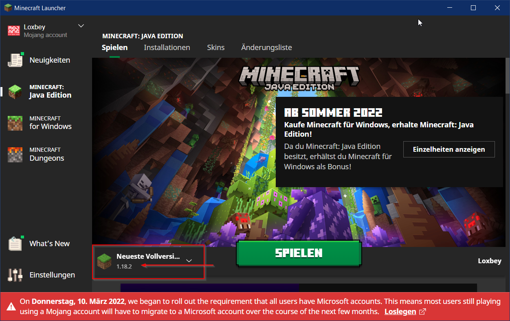
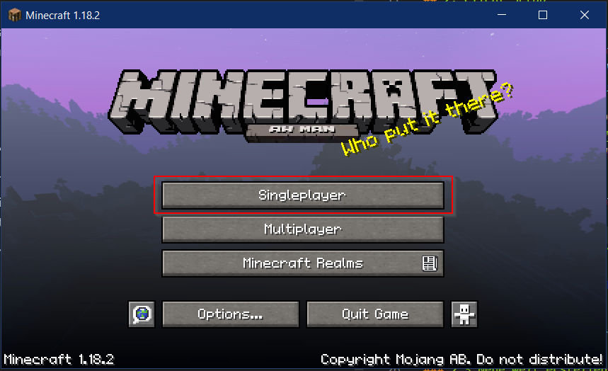
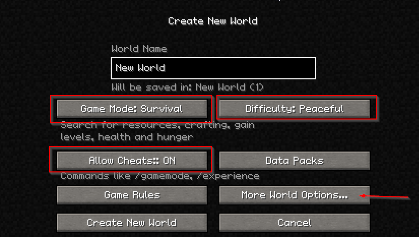
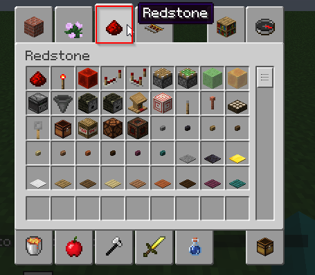

# Tutorial Minecraft Laborübung (Tag der offenen Türe)

[TOC]

## 1. Einführung

In diesem Tutorial wird das Spiel Minecraft genutzt, um Schülern das Erlernen von elektrotechnischen Konzepten spielerisch beizubringen.

Hierbei können beispielsweise logische Gatter gut erklärt werden.

In diesem Tutorial hostet der Spielleiter auf seinem PC einen Server (Er teilt das Spiel). Jedoch kann ein selbständiger Server auch aufgesetzt werden. Dies ist auch über vordefinierte Docker-Container möglich.

## 2. Client Setup

### 2.1. Launcher Download
Für die Nutzung des Minecraft Launchers muss ein kostenpflichtiger Minecraft Account erstellt werden. Anschließend kann der Minecraft Launcher  [hier heruntergeladen](https://www.minecraft.net/de-de) werden. 

Alternativ kann auch eine Open Source Version des Spiels [hier heruntergeladen](https://www.minetest.net/) werden. Jedoch habe ich persönlich mit dieser Software leider noch keine Erfahrung. (Nächste Schritte müssen selbstständig erarbeitet werden)

Beide Launcher sind auch unter diversen Linux-Distributionen verfügbar.

### 2.2 Aktuelle Minecraft Version Herunterladen
Hierbei kann innerhalb des Launchers eine Spielversion heruntergeladen werden. Bei betätigung des Buttons "Spielen" wird automatisch die neueste Version heruntergeladen.

*ACHTUNG! Die Version des Clients und des Servers MÜSSEN übereinstimmen!*

### 2.3 Neue Welt erstellen
Hierbei erstellt der Spielleiter eine neue Welt.

Zuerst wird der Button "Singleplayer" ausgewählt. Sollte bisher noch keine Welt erstellt worden sein, öffnet sich sofort das Menu für die Erstellung einer neuen Welt.

Folgende Einstellungen sollten gesetzt werden.

- Game-Mode : Survival
  - Standartweise verfügen Spieler nicht die Macht, neue Blöcke einfach zu erstellen
- Difficulty : Peaceful
  - Keine Minecraft-Gegner werden in dieser Welt vorkommen
- Allow Cheats : On
  - Hierbei kann der Spielleiter (Moderator) Konsolen-Befehle Ausführen 
- World Type: Superflat
  - Kann unter Button "More World Options" erlangt werden. Spielwelt wird flach erstellt (Keine Berge, etc.)
  

## 3. Spiel-Steuerung

| Taste        | Ergebnis    | 
|--------------|-----------|
| W, A, S, D | Vor-, Links-, Zurück- und Rechtslaufen       | 
| T      | Kommandozeile öffnen  |
| Rechtsklick      | Block Setzten  |
| Linksklick      | Block zerstören  |
| E    | Inventar öffnen/schließen  |

| Konsolenbefehle| Ereignis |
|--|--|
| `/gamemode <mode>` | Spielmodus wechseln (creative = baumodus, survival = interagiermodus, spectator = zuschauer)|
|`/kick <spielername> `| Spieler aus welt kicken|
| `/op <spielername> `| Spieler zum admin ernennen|
| `/deop <spielername> ` | Adminrechte von Spieler entfernen

### 3.1 Neue Blöcke setzen.

Um unendlich viele Blöcke setzten zu können muss in den "Kreativmodus" gewechselt werden. Dabei muss ein Konsolenbefehl eingegeben werden (Taste T):

`/gamemode creative`

Nun Kann per Taste E das Inventar geöffnet werden. Für eine Übung mit Leitungen, Schalter, etc. wird der Reiter "Redstone" verwendet.

## 4. Leitungen, Schalter in Minecraft

In Minecraft wird dies mit dem Redstone-System geregelt.

Die Funktionen von Redstone zu erklären, würde das Maß dieses Tutorials überschreiten. Hierbei können ganz einfach Tutorials auf YouTube aufgerufen werden.

[Video-Beispiel 1](https://www.youtube.com/watch?v=qrbnQVKP9oc)
[Video-Beispiel 2](https://www.youtube.com/watch?v=ooL9nVQA6qU)

Als Entwurf für einen Aufbau kann auch mein Laborprotokoll hergenommen werden.

## 5. Server als Nutzer beitreten
Hierbei muss sich der Nutzer im selben Netzwerk befinden.

*Hinweis: Möglicherweise müssen Ports auf dem Spielleiter-PC  freigegeben werden (In- & Outbound : 25565)*

Der Nutzer wählt hierbei im Hauptmenu den Button "Multiplayer" aus. Nun sollte die Spielwelt auftreten. (Ansonsten kann auch per Button "Direct Connect" über Angabe der IP connected werden)

Der Nutzer befindet sich nun im Survival mode. Um dem Nutzer in dern Creativmodus zu setzten wird ein Command unter dem Spielleiter PC ausgeführt:

`/gamemode creative <Spielername>`

## 6. Nützliche Infos

[Docker-Container Minetest](https://docs.linuxserver.io/images/docker-minetest)

[Docker-Container Minecraft](https://github.com/itzg/docker-minecraft-server)

